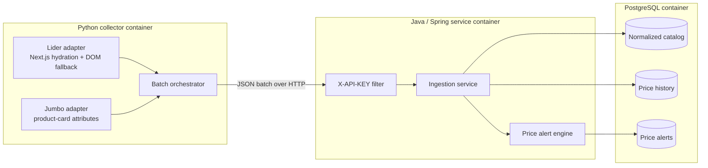
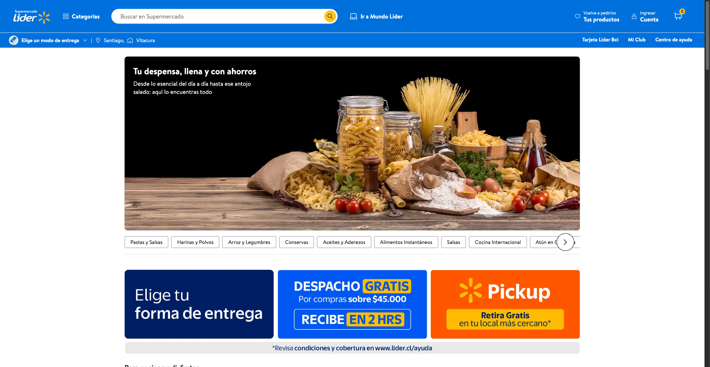
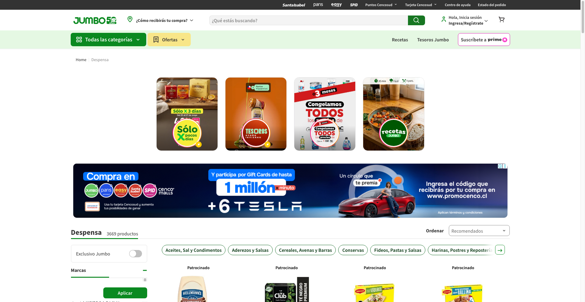

# Retail Price Intelligence

A Dockerized retail price intelligence pipeline that collects product prices from Chilean supermarkets, normalizes the catalog, preserves price history, and flags meaningful price drops.

The current collectors target **Lider** and **Jumbo**. This repository is a backend/data-engineering project; it does not include a consumer-facing dashboard.

## What it demonstrates

- Browser-based extraction from dynamic commerce sites with Python and Selenium.
- A secured ingestion boundary implemented with Java 17 and Spring Boot.
- Master-data normalization across supermarket-specific SKUs.
- Historical price storage and rolling price-drop detection in PostgreSQL.
- Reproducible local orchestration with Docker Compose.

## Architecture



### Component boundaries

| Component | Owns | Does not own |
| --- | --- | --- |
| Python collector | Browser lifecycle, retailer-specific selectors, extraction, payload creation | Catalog identity, persistence, alert decisions |
| Spring Boot service | Authentication, validation, product normalization, transactional ingestion, alert evaluation | Browser automation, database provisioning |
| PostgreSQL | Catalog relationships, supermarket SKUs, price history, generated alerts | Extraction or application workflows |
| Docker Compose | Local networking, startup order, ports, environment wiring | Production scheduling, secrets management, observability |

Data is sent to `POST /api/v1/etl/ingest` with an `X-API-KEY` header. The service maps a retailer SKU to a normalized product and records each observation. A price at least 15% below the product's rolling 15-day effective-price average creates an alert.

## Repository layout

```text
.
├── price-monitor-scraper/     # Python 3.11 + Selenium collectors
├── price-monitor-backend/     # Java 17 + Spring Boot ingestion API
├── docker/postgres/init.sql   # PostgreSQL schema and indexes
├── examples/                  # Sample API payloads
├── docker-compose.yml         # Local three-container stack
└── test_ingestion.py          # End-to-end ingestion and alert smoke test
```

## Local setup with Docker

### Prerequisites

- Docker Desktop or another Docker Engine with Compose v2
- Python 3.10+ only if you want to run the end-to-end smoke script from the host

### Start the stack

```bash
cp .env.example .env
docker compose up -d --build postgres-db backend-api
docker compose ps
```

This starts PostgreSQL on host port `5433` and the API on `http://localhost:8085`. The values in `.env.example` are local-development placeholders; replace them before using this project outside an isolated development machine.

Run the collectors once:

```bash
docker compose run --rm scraper-service
```

Retail sites change frequently and may present location, consent, or anti-automation challenges. To establish a Lider location profile interactively, run the collector locally once with `HEADLESS_SCRAPE=False`; the ignored `chrome_profile/` directory preserves that browser state.

Stop the stack:

```bash
docker compose down
```

Add `--volumes` only when you intentionally want to delete the local PostgreSQL data volume.

## Sample ingestion

The sample payload is available at [`examples/ingestion-payload.json`](examples/ingestion-payload.json).

```bash
curl --fail-with-body \
  -X POST http://localhost:8085/api/v1/etl/ingest \
  -H 'Content-Type: application/json' \
  -H 'X-API-KEY: local-dev-api-key' \
  --data @examples/ingestion-payload.json
```

Expected response:

```json
{
  "message": "Ingesta procesada de forma exitosa",
  "summary": {
    "processedCount": 1,
    "newProductsCount": 1
  }
}
```

`newProductsCount` becomes `0` when the same supermarket SKU already exists.

## Screenshots

The screenshots below are collector diagnostics from the two live source sites. They confirm that Chromium reached the configured catalog pages; extraction results are delivered as JSON rather than rendered by a project UI.

| Lider collection target | Jumbo collection target |
| --- | --- |
|  |  |

## Testing

Run the self-contained backend context test. It uses an in-memory H2 database and does not require Docker:

```bash
cd price-monitor-backend
./mvnw test
```

Check the Python collector modules without opening a browser:

```bash
python3 -m py_compile \
  price-monitor-scraper/main.py \
  price-monitor-scraper/config.py \
  price-monitor-scraper/scrapers/*.py \
  test_ingestion.py
```

Run the end-to-end alert smoke test while PostgreSQL and the API are running:

```bash
python3 -m venv .venv
source .venv/bin/activate
pip install requests
python3 test_ingestion.py
```

The script submits two observations for the same products. The second milk observation drops from CLP 1,500 to CLP 900 and should create a row in `price_alerts`.

Verify it directly:

```bash
docker compose exec postgres-db \
  psql -U monitor_user -d price_monitor_db \
  -c 'SELECT percentage_drop, is_resolved, created_at FROM price_alerts ORDER BY created_at DESC;'
```

## Run components without Docker

Backend:

```bash
cd price-monitor-backend
SPRING_DATASOURCE_URL=jdbc:postgresql://localhost:5433/price_monitor_db \
SPRING_DATASOURCE_USERNAME=monitor_user \
SPRING_DATASOURCE_PASSWORD=local-dev-password \
APP_SECURITY_API_KEY=local-dev-api-key \
./mvnw spring-boot:run
```

Collector:

```bash
cd price-monitor-scraper
python3 -m venv .venv
source .venv/bin/activate
pip install -r requirements.txt
BACKEND_API_URL=http://localhost:8085/api/v1/etl/ingest \
API_KEY=local-dev-api-key \
python3 main.py
```

The collector requires Chrome or Chromium. Selenium Manager resolves the local driver when `/usr/bin/chromedriver` is not present.

## Scope and limitations

- Product matching currently uses normalized product name plus brand; it is not a semantic entity-resolution system.
- Collectors cover configured pantry and dairy categories rather than complete retailer catalogs.
- The alert baseline includes available observations from the last 15 days and uses the lower of promotional and normal price.
- The included API key mechanism is appropriate for a small internal ingestion boundary, not a complete public identity system.
- Use collectors responsibly and review each retailer's terms, robots policy, and applicable law before operating them.

## Suggested GitHub topics

`etl`, `price-monitoring`, `retail-analytics`, `python`, `selenium`, `java`, `spring-boot`, `postgresql`, `docker`

## License

Released under the [MIT License](LICENSE).
