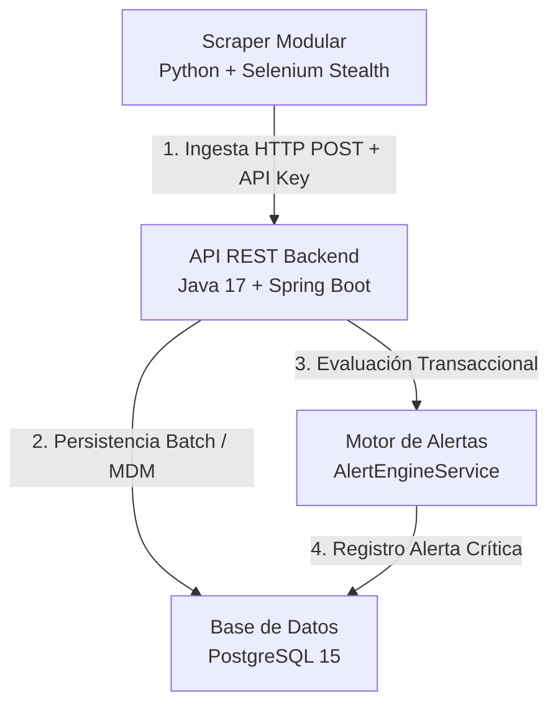

# Sistema ETL de Monitoreo de Precios (Líder vs. Jumbo)

Este monorrepisitorio de nivel de producción implementa un sistema robusto de extracción, transformación, ingesta (ETL), almacenamiento y comparación histórica de precios enfocado en los supermercados chilenos **Líder (lider.cl)** y **Jumbo (jumbo.cl)** para la detección inteligente de ofertas críticas.

---

## Arquitectura y Flujo de Datos

El sistema se compone de tres microservicios principales contenerizados de forma aislada que interactúan de forma fluida a través de una red privada virtual de Docker:



1. **Extracción (E - Python):** Un scraper emulado en Python con Selenium y emulación de firmas avanzadas (`selenium-stealth`). Emplea estrategias híbridas (hidratación JSON en Líder e inspección VTEX en Jumbo) para recolectar el catálogo sin bloqueos.
2. **Transformación, Carga y Lógica (TL - Spring Boot):** Una API REST robusta que desduplica marcas, categorías y mapea equivalencias de productos entre cadenas creando un catálogo maestro unificado. Realiza inserciones en lote optimizadas en base de datos.
3. **Persistencia (PostgreSQL):** Almacena de forma eficiente el histórico de precios e índices relacionales de productos y alertas críticas generadas.

---

## Estructura del Monorrepisitorio

```
/
├── price-monitor-backend/        # API REST en Spring Boot 4.0.6 (Java 17)
├── price-monitor-scraper/        # Scrapers modulares en Python 3.11 + Chromium Headless
├── docker/
│   └── postgres/
│       └── init.sql              # Script DDL de inicialización de la Base de Datos
├── .env.example                  # Plantilla de variables de entorno de producción
├── docker-compose.yml            # Orquestador del ecosistema completo
├── test_ingestion.py             # Script de validación de integración extremo a extremo (E2E)
└── README.md                     # Este documento descriptivo raíz
```

---

## Guía de Despliegue Rápido (1 Paso)

El entorno completo está automatizado mediante Docker Compose. Solo necesitas tener instalado **Docker** y **Docker Compose**.

### 1. Iniciar el Ecosistema Completo
Desde la raíz del proyecto, ejecuta el siguiente comando para compilar las imágenes e iniciar los contenedores de forma aislada en segundo plano:

```bash
docker compose up -d --build
```

Esto aprovisionará e iniciará secuencialmente:
1. `postgres-db`: PostgreSQL escuchando en el puerto interno `5432` (mapeado al **`5433`** del host).
2. `backend-api`: API Spring Boot escuchando en el puerto interno `8080` (mapeado al **`8085`** del host) esperando que la BD esté saludable.
3. `scraper-service`: Scraper en Python listo para ejecutar las tareas de extracción y transmitirlas de forma segura a la API.

### 2. Verificar la Salud de los Servicios
Puedes revisar los logs de inicio y funcionamiento de cada contenedor:

* **Logs de la Base de Datos (DDL e Índices):**
  ```bash
  docker logs etl-postgres-db
  ```
* **Logs del Servidor REST (Spring Boot):**
  ```bash
  docker logs etl-spring-backend
  ```
* **Logs del Scraper (Selenium):**
  ```bash
  docker logs etl-python-scraper
  ```

---

## Cómo Probar la Integración Extremo a Extremo (E2E)

Para validar que el pipeline de ingesta batch, el algoritmo de desduplicación del catálogo maestro y el motor de alertas de descuentos funcionan de forma 100% correcta sin esperar a que el scraper termine una recolección real, hemos integrado un script de validación automatizada.

### 1. Ejecutar el Script de Simulación
El script `test_ingestion.py` inyectará consecutivamente dos lotes de datos con fechas de extracción diferentes para el mismo supermercado (Líder):
* **Lote Anterior (Ayer):** Registra una "Leche Entera Soprole 1L" a un precio de lista de `$1.500`. Esto inicializa el catálogo maestro y la persistencia de histórico en PostgreSQL.
* **Lote Actual (Hoy):** Registra una nueva extracción donde la misma leche tiene un descuento promocional agresivo a **`$900`** (una **baja de precio crítica del 40%** frente al histórico).

Ejecuta el script localmente:
```bash
python3 test_ingestion.py
```

### 2. Confirmar Detección de Alertas en logs
El backend procesará los datos, asociará el producto al catálogo maestro y evaluará la variación del precio efectivo frente al promedio de los últimos 15 días móviles (calculado en un **25% de descuento** sobre el promedio de $1.200). 

Al ver los logs del backend (`docker logs etl-spring-backend`), comprobarás que se generó la alerta crítica en producción:
```
2026-05-27T21:35:51.328Z  INFO 1 --- [nio-8080-exec-3] c.p.backend.service.AlertEngineService   : ALERTA CRÍTICA: Detección de baja de precio para el producto 'Leche Entera Soprole 1L'. Precio actual: $900, Precio promedio (15 días): $1200 (Descuento del 25%)
```

### 3. Verificar Persistencia Física en Base de Datos
Puedes conectarte directamente al contenedor de PostgreSQL y realizar una consulta SQL en la tabla `price_alerts` para comprobar que el registro de la alerta se guardó correctamente con su UUID e integridad referencial:

```bash
docker exec etl-postgres-db psql -U monitor_user -d price_monitor_db -c "SELECT * FROM price_alerts;"
```

**Resultado esperado de la base de datos:**
```
                  id                  |              product_id              |           price_history_id           | percentage_drop | is_resolved |          created_at           
--------------------------------------+--------------------------------------+--------------------------------------+-----------------+-------------+-------------------------------
 918dfa05-68b0-4b65-963d-68dba3d100eb | d49f35ea-7c4d-4e66-afc3-dbb441a94b04 | 98c56c2e-f524-4e8e-854a-a25640c1c000 |           25.00 | f           | 2026-05-27 21:35:51.328731+00
```

---

## Ejecución del Scraping en Vivo (Páginas Reales)

El scraper de Python está configurado para conectarse en vivo a **super.lider.cl** y **jumbo.cl**, extraer las categorías parametrizadas en [config.py](file:///Users/luisr/Proyectos/ETL%20-%20Monitoreo%20de%20Precios/price-monitor-scraper/config.py) (Despensa y Lácteos) e inyectarlas al Backend.

### Estrategias de Extracción de Alto Rendimiento e Evasión
Para garantizar que el scraper sea robusto y apto para producción, se diseñó bajo dos pilares avanzados:
1. **Walmart "Tempo" Next.js Hydration Decoupling (Líder):** En lugar de parsear divs dinámicos y frágiles en el DOM, el scraper intercepta la etiqueta `<script id="__NEXT_DATA__">` y decodifica recursivamente el estado JSON del nuevo framework e-commerce **"Tempo"** de Walmart (`initialTempoData`). Esto permite extraer el código de barras universal EAN/GTIN (`usItemId`) como SKU y procesar descuentos desde `wasPrice` a máxima velocidad y con 100% de fidelidad.
2. **VTEX Native Attributes (Jumbo):** Las tarjetas de producto en Jumbo se localizan unívocamente mediante el atributo nativo de búsqueda `//div[@data-cnstrc-item-id]`. El SKU, nombre y precio se extraen directamente de los atributos del contenedor, haciéndolo inmune a cambios visuales en el front-end.

---

### Geolocalización y Bypass de Modales (Líder)
Walmart (Líder) redirige de forma forzada a los usuarios nuevos abriendo un modal que bloquea la pantalla pidiendo elegir un modo de entrega. Para solucionar esto sin inyectar código complejo, implementamos **Persistencia de Perfil de Chrome (Chrome User Data Directory)**:

#### Configuración Inicial (Solo 1 vez):
Para guardar de forma permanente las cookies de ubicación en tu máquina local:
1. Asegúrate de estar en el directorio del scraper:
   ```bash
   cd price-monitor-scraper
   ```
2. Ejecuta el scraper en modo **visible** (interactivo):
   ```bash
   HEADLESS_SCRAPE=False python3 main.py
   ```
3. Cuando se abra la ventana emulada de Chrome, haz clic en **"Retiro Pickup"** o **"Despacho"** en el modal de Líder y selecciona una tienda (ej. Vitacura).
4. Chrome guardará las cookies de sesión y geolocalización dentro de la carpeta local `price-monitor-scraper/chrome_profile/`.

*¡Listo! Todas las ejecuciones futuras (locales o mediante Docker en segundo plano en modo Headless `HEADLESS_SCRAPE=True`) leerán automáticamente el perfil persistente, omitirán el modal de Walmart y extraerán los productos de forma 100% autónoma sin intervención humana.*

---

### Métodos de Ejecución

#### Método A: Ejecución en Vivo mediante Docker (Recomendado)
El scraper corre una extracción completa de forma automática la primera vez que levantas el compose (`docker compose up -d`).

Si deseas **volver a gatillar la extracción en vivo bajo demanda** en cualquier momento posterior (para registrar un nuevo histórico), solo debes iniciar el servicio:
```bash
docker compose start scraper-service
```
*Este comando despertará al contenedor del scraper, el cual abrirá Chromium en segundo plano, leerá las cookies, extraerá los precios en vivo de Líder y Jumbo, transmitirá el lote al backend y se apagará de forma limpia automáticamente.*

Seguir logs en tiempo real:
```bash
docker logs -f etl-python-scraper
```

#### Método B: Ejecución Interactiva Local
Si estás depurando en desarrollo y quieres ejecutar el scraper directamente sobre tu host:
1. Asegurar que los contenedores de la Base de Datos y Backend estén arriba (en los puertos `5433` y `8085`).
2. Ingresar al directorio del scraper:
   ```bash
   cd price-monitor-scraper
   ```
3. Activar el entorno virtual e iniciar la recolección:
   ```bash
   source venv/bin/activate
   python3 main.py
   ```

   