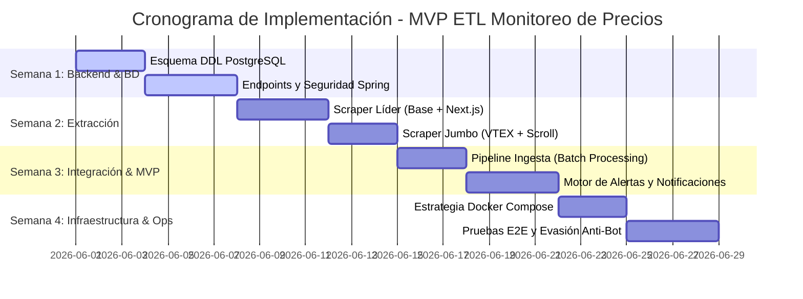

# Plan de Proyecto: Sistema ETL de Monitoreo de Precios (Líder vs. Jumbo)
**Rol:** Arquitecto de Software & Líder Técnico Senior

Este documento detalla la arquitectura, el diseño técnico y la estrategia de implementación para construir un sistema ETL robusto, escalable y contenerizado enfocado en la extracción, ingesta, comparación histórica y generación de alertas de precios para los supermercados chilenos Líder y Jumbo.

---

## 1. Arquitectura y Diseño de Base de Datos (PostgreSQL)

Para soportar la variabilidad de SKUs entre diferentes cadenas y permitir una comparación directa y analítica de productos idénticos, utilizaremos un modelo relacional de catálogo unificado. Un producto global (ej. *Leche Semidescremada Soprole 1L*) se mapea a los SKUs específicos de cada supermercado mediante una tabla de equivalencias.

### Modelo Entidad-Relación (DDL de Producción)

```sql
-- Habilitar extensión para UUIDs
CREATE EXTENSION IF NOT EXISTS "uuid-ossp";

-- 1. Tabla de Categorías
CREATE TABLE categories (
    id UUID PRIMARY KEY DEFAULT uuid_generate_v4(),
    name VARCHAR(100) NOT NULL UNIQUE,
    slug VARCHAR(100) NOT NULL UNIQUE,
    created_at TIMESTAMP WITH TIME ZONE DEFAULT CURRENT_TIMESTAMP
);

-- 2. Tabla de Marcas
CREATE TABLE brands (
    id UUID PRIMARY KEY DEFAULT uuid_generate_v4(),
    name VARCHAR(100) NOT NULL UNIQUE,
    created_at TIMESTAMP WITH TIME ZONE DEFAULT CURRENT_TIMESTAMP
);

-- 3. Catálogo Maestro de Productos Unificados
CREATE TABLE products (
    id UUID PRIMARY KEY DEFAULT uuid_generate_v4(),
    name VARCHAR(255) NOT NULL,
    brand_id UUID REFERENCES brands(id) ON DELETE SET NULL,
    category_id UUID REFERENCES categories(id) ON DELETE SET NULL,
    created_at TIMESTAMP WITH TIME ZONE DEFAULT CURRENT_TIMESTAMP,
    updated_at TIMESTAMP WITH TIME ZONE DEFAULT CURRENT_TIMESTAMP
);

-- 4. Relación de Productos por Supermercado (Mapeo de SKUs)
CREATE TABLE supermarket_products (
    id UUID PRIMARY KEY DEFAULT uuid_generate_v4(),
    product_id UUID REFERENCES products(id) ON DELETE CASCADE,
    supermarket VARCHAR(50) NOT NULL CHECK (supermarket IN ('LIDER', 'JUMBO')),
    sku_supermarket VARCHAR(100) NOT NULL,
    url TEXT NOT NULL,
    is_active BOOLEAN DEFAULT TRUE,
    created_at TIMESTAMP WITH TIME ZONE DEFAULT CURRENT_TIMESTAMP,
    updated_at TIMESTAMP WITH TIME ZONE DEFAULT CURRENT_TIMESTAMP,
    CONSTRAINT unique_supermarket_sku UNIQUE (supermarket, sku_supermarket)
);

-- 5. Histórico de Precios
CREATE TABLE price_histories (
    id UUID PRIMARY KEY DEFAULT uuid_generate_v4(),
    supermarket_product_id UUID NOT NULL REFERENCES supermarket_products(id) ON DELETE CASCADE,
    price_normal INT NOT NULL CHECK (price_normal >= 0),
    price_promo INT, -- Puede ser NULL si no hay oferta activa
    extraction_date TIMESTAMP WITH TIME ZONE NOT NULL,
    is_available BOOLEAN DEFAULT TRUE,
    created_at TIMESTAMP WITH TIME ZONE DEFAULT CURRENT_TIMESTAMP
);

-- 6. Alertas de Bajada de Precios
CREATE TABLE price_alerts (
    id UUID PRIMARY KEY DEFAULT uuid_generate_v4(),
    product_id UUID NOT NULL REFERENCES products(id) ON DELETE CASCADE,
    price_history_id UUID NOT NULL REFERENCES price_histories(id) ON DELETE CASCADE,
    percentage_drop NUMERIC(5,2) NOT NULL,
    is_resolved BOOLEAN DEFAULT FALSE,
    created_at TIMESTAMP WITH TIME ZONE DEFAULT CURRENT_TIMESTAMP
);

-- Índices de Rendimiento
CREATE INDEX idx_products_name ON products USING gin(to_tsvector('spanish', name));
CREATE INDEX idx_price_histories_date_prod ON price_histories (extraction_date, supermarket_product_id);
CREATE INDEX idx_supermarket_products_lookup ON supermarket_products (product_id, supermarket);
```

### Consulta SQL Analítica: Comparador de Precios en la Fecha Actual

Esta consulta retorna qué supermercado tiene el mejor precio para cada producto hoy, calculando el "precio efectivo" (el menor entre el normal y el de oferta) y resolviendo empates de manera eficiente:

```sql
WITH current_prices AS (
    -- Obtener la última extracción de hoy para cada producto y supermercado
    SELECT DISTINCT ON (sp.product_id, sp.supermarket)
        sp.product_id,
        p.name AS product_name,
        sp.supermarket,
        ph.price_normal,
        ph.price_promo,
        LEAST(ph.price_normal, COALESCE(ph.price_promo, ph.price_normal)) AS effective_price,
        ph.extraction_date
    FROM price_histories ph
    JOIN supermarket_products sp ON ph.supermarket_product_id = sp.id
    JOIN products p ON sp.product_id = p.id
    WHERE ph.extraction_date::date = CURRENT_DATE
      AND ph.is_available = TRUE
    ORDER BY sp.product_id, sp.supermarket, ph.extraction_date DESC
),
ranked_prices AS (
    -- Clasificar por precio efectivo ascendente para cada producto unificado
    SELECT 
        product_id,
        product_name,
        supermarket,
        price_normal,
        price_promo,
        effective_price,
        extraction_date,
        ROW_NUMBER() OVER(
            PARTITION BY product_id 
            ORDER BY effective_price ASC, price_normal ASC
        ) as price_rank
    FROM current_prices
)
-- Retornar solo el registro con precio_rank = 1 (el mejor precio)
SELECT 
    product_id,
    product_name,
    supermarket AS best_supermarket,
    price_normal,
    price_promo,
    effective_price AS best_price,
    extraction_date
FROM ranked_prices
WHERE price_rank = 1;
```

---

## 2. Fase de Extracción (Python + Selenium)

La extracción de datos en sitios de retail moderno como Jumbo y Líder requiere una estrategia resiliente y modular que evite detecciones basadas en comportamientos automatizados y maneje la carga asíncrona mediante Single Page Applications (SPAs).

### Estructura del Módulo de Extracción

El scraper se organiza bajo el patrón de diseño *Factory* y herencia modular:

```
scraper/
│
├── config.py             # Configuración de URLs, cabeceras y constantes
├── main.py               # Orquestador del flujo ETL de Extracción
├── requirements.txt      # Dependencias (selenium, selenium-stealth, requests)
│
└── scrapers/
    ├── __init__.py
    ├── base_scraper.py   # Configuración de WebDriver, evasión y esperas
    ├── lider_scraper.py  # Lógica específica y selectores para Lider
    └── jumbo_scraper.py  # Lógica específica y selectores para Jumbo
```

### Configuración del WebDriver y Evasión de Bloqueos (`base_scraper.py`)

Para mitigar los bloqueos de WAF (Cloudflare/Akamai), configuramos Selenium en modo headless con argumentos específicos y aplicamos `selenium-stealth`:

```python
import time
from selenium import webdriver
from selenium.webdriver.chrome.service import Service
from selenium.webdriver.chrome.options import Options
from selenium.webdriver.common.by import By
from selenium.webdriver.support.ui import WebDriverWait
from selenium.webdriver.support import expected_conditions as EC
from selenium_stealth import stealth

class BaseScraper:
    def __init__(self, headless=True):
        self.options = Options()
        if headless:
            self.options.add_argument("--headless=new")
        self.options.add_argument("--no-sandbox")
        self.options.add_argument("--disable-dev-shm-usage")
        self.options.add_argument("--disable-blink-features=AutomationControlled")
        self.options.add_experimental_option("excludeSwitches", ["enable-automation"])
        self.options.add_experimental_option('useAutomationExtension', False)
        
        # User-Agent realista
        self.options.add_argument("user-agent=Mozilla/5.0 (Macintosh; Intel Mac OS X 10_15_7) AppleWebKit/537.36 (KHTML, like Gecko) Chrome/120.0.0.0 Safari/537.36")
        
        # Inicializar Driver (se asume ChromeDriver en PATH o manejador en el contenedor)
        self.driver = webdriver.Chrome(options=self.options)
        
        # Aplicar evasión stealth
        stealth(self.driver,
            languages=["es-CL", "es"],
            vendor="Google Inc.",
            platform="MacIntel",
            webgl_vendor="Intel Inc.",
            renderer="Intel Iris OpenGL Engine",
            fix_hairline=True,
        )

    def wait_for_element(self, xpath, timeout=15):
        """Manejo de esperas explícitas para elementos dinámicos"""
        return WebDriverWait(self.driver, timeout).until(
            EC.presence_of_element_located((By.XPATH, xpath))
        )
        
    def scroll_to_bottom(self):
        """Scroll incremental para forzar la carga asíncrona de imágenes y datos"""
        last_height = self.driver.execute_script("return document.body.scrollHeight")
        while True:
            self.driver.execute_script("window.scrollTo(0, document.body.scrollHeight);")
            time.sleep(1.5)  # Espera para renderizado
            new_height = self.driver.execute_script("return document.body.scrollHeight")
            if new_height == last_height:
                break
            last_height = new_height

    def close(self):
        self.driver.quit()
```

### Estrategias de Scraping por Supermercado

1. **Líder (lider.cl):** Utiliza Next.js con renderizado híbrido. Se puede interceptar el JSON de hydration buscando la etiqueta `<script id="__NEXT_DATA__" type="application/json">` en el HTML, lo cual evita tener que parsear el DOM elemento por elemento y acelera la extracción.
2. **Jumbo (jumbo.cl):** Basado en VTEX. Requiere navegación por scroll dinámico. Los selectores CSS preferibles son aquellos estables asociados a atributos semánticos de producto (ej. `[data-testid="product-card"]` o clases específicas de marca y SKU).

### Payload JSON de Salida

Cada script formateará los datos recolectados y los consolidará en el siguiente formato JSON estandarizado para ser enviado mediante un `POST` HTTP al backend:

```json
{
  "supermarket": "LIDER",
  "extractionDate": "2026-05-27T18:00:00Z",
  "products": [
    {
      "skuSupermarket": "758493",
      "name": "Aceite de Oliva Extra Virgen 500ml",
      "brand": "Casta de Olivia",
      "category": "Despensa",
      "priceNormal": 7890,
      "pricePromo": 6490,
      "url": "https://www.lider.cl/supermercado/product/sku/758493",
      "isAvailable": true
    },
    {
      "skuSupermarket": "893041",
      "name": "Arroz Grano Largo Ancho Grado 1 1kg",
      "brand": "Miraflores",
      "category": "Despensa",
      "priceNormal": 1890,
      "pricePromo": null,
      "url": "https://www.lider.cl/supermercado/product/sku/893041",
      "isAvailable": true
    }
  ]
}
```

---

## 3. Fase de Integración y Backend (Java + Spring Boot)

El backend expone endpoints REST seguros, procesa el payload de extracción en lotes para minimizar la latencia de base de datos y evalúa reglas de negocio para alertas de precios de forma reactiva/asíncrona.

### Estructura de Endpoints REST (Seguridad e Ingesta)

Usaremos **Spring Security** para exigir una API Key de extracción (`X-API-KEY`) en el flujo REST.

```java
@RestController
@RequestMapping("/api/v1/etl")
@RequiredArgsConstructor
public class PriceIngestionController {

    private final IngestionService ingestionService;

    @PostMapping("/ingest")
    public ResponseEntity<IngestionResponse> ingestPrices(
            @RequestHeader("X-API-KEY") String apiKey,
            @Valid @RequestBody IngestionPayload payload) {
        
        // Validación de API Key (Puede externalizarse en un Filter de Spring Security)
        if (!"PROD_SECURE_EXTRACTOR_KEY_2026".equals(apiKey)) {
            return ResponseEntity.status(HttpStatus.UNAUTHORIZED).build();
        }
        
        IngestionSummary summary = ingestionService.processPayload(payload);
        return ResponseEntity.ok(new IngestionResponse("Ingesta Procesada Exitosamente", summary));
    }
}
```

### Procesamiento por Lotes y Desduplicación en la Capa de Servicio

Para optimizar el rendimiento y evitar problemas de concurrencia, el backend implementa una estrategia de "Upsert" a través de transacciones por lotes utilizando JPA/Hibernate:

```java
@Service
@RequiredArgsConstructor
public class IngestionService {

    private final ProductRepository productRepository;
    private final SupermarketProductRepository supermarketProductRepository;
    private final PriceHistoryRepository priceHistoryRepository;
    private final AlertEngineService alertEngineService;
    private final BrandRepository brandRepository;
    private final CategoryRepository categoryRepository;

    @Transactional
    public IngestionSummary processPayload(IngestionPayload payload) {
        int processedCount = 0;
        int newProductsCount = 0;
        
        Instant extractionTime = payload.getExtractionDate();
        String supermarket = payload.getSupermarket();

        for (ProductDto dto : payload.getProducts()) {
            // 1. Obtener o crear Marca y Categoría de forma segura (Desduplicación)
            Brand brand = brandRepository.findByNameIgnoreCase(dto.getBrand())
                    .orElseGet(() -> brandRepository.save(new Brand(dto.getBrand())));
                    
            Category category = categoryRepository.findByNameIgnoreCase(dto.getCategory())
                    .orElseGet(() -> categoryRepository.save(new Category(dto.getCategory())));

            // 2. Mapear o registrar en catálogo Maestro 'products'
            // En un MVP, si no existe el SKU del supermercado, intentamos buscar el producto maestro por coincidencia semántica
            // o creamos uno nuevo.
            SupermarketProduct spProduct = supermarketProductRepository
                    .findBySupermarketAndSkuSupermarket(supermarket, dto.getSkuSupermarket())
                    .orElse(null);

            Product product;
            if (spProduct == null) {
                // Producto Nuevo para este supermercado
                product = productRepository.findByNameIgnoreCaseAndBrand(dto.getName(), brand)
                        .orElseGet(() -> {
                            Product p = new Product();
                            p.setName(dto.getName());
                            p.setBrand(brand);
                            p.setCategory(category);
                            return productRepository.save(p);
                        });
                
                spProduct = new SupermarketProduct();
                spProduct.setProduct(product);
                spProduct.setSupermarket(supermarket);
                spProduct.setSkuSupermarket(dto.getSkuSupermarket());
                spProduct.setUrl(dto.getUrl());
                spProduct = supermarketProductRepository.save(spProduct);
                newProductsCount++;
            } else {
                product = spProduct.getProduct();
            }

            // 3. Registrar Historial de Precios
            PriceHistory priceHistory = new PriceHistory();
            priceHistory.setSupermarketProduct(spProduct);
            priceHistory.setPriceNormal(dto.getPriceNormal());
            priceHistory.setPricePromo(dto.getPricePromo());
            priceHistory.setExtractionDate(extractionTime);
            priceHistory.setIsAvailable(dto.getIsAvailable());
            PriceHistory savedPrice = priceHistoryRepository.save(priceHistory);

            // 4. Analizar asíncronamente si amerita Alerta de precio
            alertEngineService.evaluatePriceAlert(product, savedPrice);
            
            processedCount++;
        }

        return new IngestionSummary(processedCount, newProductsCount);
    }
}
```

### Mecanismo de Generación de Alertas Automatizadas

El motor de alertas se procesa de manera asíncrona empleando `@Async` para no bloquear la respuesta HTTP de ingesta. Compara el precio efectivo actual del producto contra su precio promedio histórico de los últimos 15 días:

```java
@Service
@RequiredArgsConstructor
@Slf4j
public class AlertEngineService {

    private final PriceHistoryRepository priceHistoryRepository;
    private final PriceAlertRepository priceAlertRepository;

    @Async("alertExecutor")
    @Transactional
    public void evaluatePriceAlert(Product product, PriceHistory currentPrice) {
        // Obtener el precio efectivo actual (el menor entre normal y promo)
        int currentEffectivePrice = currentPrice.getPricePromo() != null ? 
                                    currentPrice.getPricePromo() : currentPrice.getPriceNormal();

        // 1. Obtener precio promedio de los últimos 15 días para este producto
        Instant limitDate = Instant.now().minus(15, ChronoUnit.DAYS);
        Double averagePrice = priceHistoryRepository.calculateAverageEffectivePriceForProduct(
                product.getId(), limitDate
        );

        if (averagePrice == null || averagePrice == 0.0) {
            return; // Sin histórico suficiente para comparar
        }

        // 2. Evaluar reducción de precio (Umbral crítico: 15% de descuento sobre promedio)
        double dropPercentage = ((averagePrice - currentEffectivePrice) / averagePrice) * 100;
        double threshold = 15.0; 

        if (dropPercentage >= threshold) {
            log.info("ALERTA: Detección de baja crítica para: {} - Descuento del {}%", product.getName(), dropPercentage);
            
            PriceAlert alert = new PriceAlert();
            alert.setProduct(product);
            alert.setPriceHistory(currentPrice);
            alert.setPercentageDrop(BigDecimal.valueOf(dropPercentage));
            alert.setIsResolved(false);
            priceAlertRepository.save(alert);
            
            // Aquí se integraría la notificación externa (e-mail, webhook de Discord/Telegram, etc.)
        }
    }
}
```

---

## 4. Containerización e Infraestructura (Docker)

El sistema completo se encapsula en una red aislada utilizando Docker Compose, facilitando la portabilidad, el despliegue local y los ambientes de integración continua.

### Configuración del Multi-Contenedor (`docker-compose.yml`)

```yaml
version: '3.8'

networks:
  etl_network:
    driver: bridge

volumes:
  postgres_data:
    driver: local

services:
  # 1. Base de Datos (PostgreSQL)
  postgres-db:
    image: postgres:15-alpine
    container_name: etl-postgres-db
    environment:
      POSTGRES_DB: price_monitor_db
      POSTGRES_USER: monitor_user
      POSTGRES_PASSWORD: SecretProductionPassword2026
    ports:
      - "5432:5432"
    volumes:
      - postgres_data:/var/lib/postgresql/data
      # Script de inicialización DDL automático
      - ./docker/postgres/init.sql:/docker-entrypoint-initdb.d/init.sql
    networks:
      - etl_network
    healthcheck:
      test: ["CMD-SHELL", "pg_isready -U monitor_user -d price_monitor_db"]
      interval: 10s
      timeout: 5s
      retries: 5

  # 2. Servidor Backend (Java Spring Boot)
  backend-api:
    build:
      context: ./backend
      dockerfile: Dockerfile
    container_name: etl-spring-backend
    ports:
      - "8080:8080"
    environment:
      - SPRING_DATASOURCE_URL=jdbc:postgresql://postgres-db:5432/price_monitor_db
      - SPRING_DATASOURCE_USERNAME=monitor_user
      - SPRING_DATASOURCE_PASSWORD=SecretProductionPassword2026
      - SPRING_JPA_HIBERNATE_DDL_AUTO=validate
      - SERVER_PORT=8080
    depends_on:
      postgres-db:
        condition: service_healthy
    networks:
      - etl_network

  # 3. Orquestador de Extracción (Scraper Python + Chrome + Selenium)
  scraper-service:
    build:
      context: ./scraper
      dockerfile: Dockerfile
    container_name: etl-python-scraper
    environment:
      - BACKEND_API_URL=http://backend-api:8080/api/v1/etl/ingest
      - API_KEY=PROD_SECURE_EXTRACTOR_KEY_2026
      - SCRAPE_INTERVAL_MINUTES=360 # Corre cada 6 horas
    depends_on:
      - backend-api
    networks:
      - etl_network
```

### Dockerfile del Scraper (`./scraper/Dockerfile`)

Para desplegar Selenium en un entorno headless de producción, la imagen de Docker debe incluir Google Chrome y el respectivo controlador WebDriver:

```dockerfile
FROM python:3.11-slim

# Instalar dependencias del sistema y Google Chrome
RUN apt-get update && apt-get install -y \
    wget \
    gnupg \
    unzip \
    curl \
    --no-install-recommends && \
    curl -sS -o - https://dl-ssl.google.com/linux/linux_signing_key.pub | apt-key add - && \
    echo "deb [arch=amd64] http://dl.google.com/linux/chrome/deb/ stable main" >> /etc/apt/sources.list.d/google-chrome.list && \
    apt-get update && apt-get install -y \
    google-chrome-stable \
    --no-install-recommends && \
    rm -rf /var/lib/apt/lists/*

# Configurar directorio de trabajo
WORKDIR /app

# Instalar dependencias de Python
COPY requirements.txt .
RUN pip install --no-cache-dir -r requirements.txt

# Copiar scripts
COPY . .

# Comando de ejecución (Un loop controlado por script o tarea programada por Cron interno)
CMD ["python", "main.py"]
```

---

## 5. Cronograma de Desarrollo y Entregables (4 Semanas)

El proyecto se divide en sprints semanales enfocados en metodologías ágiles (Scrum) para entregar un MVP funcional al cierre de la Semana 3, reservando la Semana 4 para optimización, orquestación y estabilización de bloqueos.

### Hitos y Desglose de Tareas



#### Semana 1: Cimientos del Backend y Modelo Relacional
*   **Entregable:** Base de datos PostgreSQL inicializada y API de Spring Boot estructurada.
*   **Hitos Técnicos:**
    *   Montar e inicializar el servidor PostgreSQL mediante Docker. Ejecutar scripts de DDL con índices de rendimiento y restricciones de integridad.
    *   Crear proyecto Spring Boot (Spring Boot 3.x, Java 17+, Spring Data JPA, Spring Security).
    *   Definir entidades JPA (`Product`, `SupermarketProduct`, `PriceHistory`, `PriceAlert`, `Brand`, `Category`).
    *   Configurar el endpoint REST de ingesta seguro (`/api/v1/etl/ingest`) con validación de payload y cabecera de autenticación (`X-API-KEY`).

#### Semana 2: Extracción Resiliente y Modular
*   **Entregable:** Scripts Python funcionales de extracción automatizada para Líder y Jumbo.
*   **Hitos Técnicos:**
    *   Estructurar el módulo base `BaseScraper` con evasión básica de bloqueos (Selenium Stealth, configuraciones avanzadas de Chrome Options).
    *   Desarrollar `lider_scraper.py` implementando la estrategia de extracción directa mediante la interceptación del JSON hydrate (`__NEXT_DATA__`).
    *   Desarrollar `jumbo_scraper.py` implementando la lógica de scroll infinito adaptativo y selectores CSS dinámicos robustos.
    *   Escribir el orquestador `main.py` para mapear los resultados y consolidar el payload JSON esperado por el Backend.

#### Semana 3: Pipeline de Ingesta, Desduplicación y Motor de Alertas (MVP Funcional)
*   **Entregable:** MVP que realiza scraping e integra datos alertando fluctuaciones críticas.
*   **Hitos Técnicos:**
    *   Implementar la lógica transaccional de desduplicación de marcas, categorías y mapeo de productos equivalentes por supermercado en la base de datos.
    *   Asegurar inserciones batch optimizadas para el procesamiento del historial de precios sin ahogar el pool de conexiones de Postgres.
    *   Desarrollar el `AlertEngineService` asíncrono con consultas nativas SQL para calcular precios promedio de 15 días móviles y registrar alertas ante caídas mayores o iguales al 15%.

#### Semana 4: Dockerización Global, Pruebas E2E y Resiliencia Anti-Bot
*   **Entregable:** Sistema completamente automatizado, desplegado en Docker, listo para producción.
*   **Hitos Técnicos:**
    *   Configurar el `Dockerfile` optimizado para el scraper con dependencias Chromium instaladas y el archivo `docker-compose.yml` para integrar y orquestar los tres servicios.
    *   Implementar políticas de reintento en el scraper ante fallos de conexión (Timeout o respuestas de bloqueo HTTP 403 / 503).
    *   Ejecutar pruebas integrales extremo a extremo (E2E) simulando extracciones reales consecutivas y verificando la persistencia y la detección de alertas.

---

## 6. Estándares de Ingeniería y Buenas Prácticas (Git & Documentación)

Para garantizar la profesionalidad, mantenibilidad y transferibilidad de este proyecto, se establecen estándares rigurosos para la estructura de repositorios y el flujo de control de versiones.

### Estructura Profesional del Repositorio por Componente

Cada repositorio o módulo del proyecto (Scraper, Backend, Base de Datos si está aislada) debe estructurarse de manera profesional y autosuficiente. Ejemplo de estructura de directorios:

```
modulo-api/
│
├── src/                  # Código fuente de producción
├── swagger/              # Documentación de API (OpenAPI/Swagger YAML)
├── screenshots/          # Evidencia visual de funcionamiento y pruebas
├── .env.example          # Plantilla de variables de entorno (sin secretos)
├── docker-compose.yml    # Orquestación del servicio local
├── README.md             # Documento principal de documentación
└── .gitignore            # Exclusiones de Git (evitando subir secretos o dependencias)
```

### Requisitos del archivo README.md

Cada componente de la arquitectura debe contar con un archivo `README.md` exhaustivo y bien estructurado que sirva como única fuente de verdad para el despliegue y desarrollo. Debe contener obligatoriamente:

1. **Descripción:** Resumen claro de la responsabilidad del componente dentro del ecosistema ETL.
2. **Stack Tecnológico:** Lista detallada de lenguajes, frameworks y librerías utilizadas con sus respectivas versiones estables.
3. **Arquitectura:** Diagrama o explicación de cómo fluyen los datos dentro del componente.
4. **Endpoints / Contratos de Datos:** Definición detallada de las rutas HTTP, métodos, cabeceras requeridas y esquemas JSON (para el backend) o formato de extracción (para el scraper).
5. **Instrucciones de Despliegue:** Paso a paso exacto para compilar e iniciar el componente en desarrollo local.
6. **Variables de Entorno:** Tabla con las configuraciones requeridas, su propósito y valores sugeridos.
7. **Screenshots:** Evidencia de funcionamiento (ej. peticiones de Postman, logs exitosos, base de datos poblada).
8. **Docker Setup:** Comandos exactos para construir y correr el contenedor de forma independiente.

### Política de Commits Profesional (Conventional Commits)

Se prohíben commits informales, vagos o redundantes del tipo *"final final definitivo"* o *"cambios"*. Es obligatorio utilizar el estándar de **Conventional Commits** para mantener un historial limpio, legible y automatizable.

El formato del mensaje de commit debe ser: `<tipo>(<alcance opcional>): <descripción corta en minúsculas>`

#### Tipos de Commits Permitidos:

*   **`feat`:** Incorporación de una nueva funcionalidad al sistema.
    *   *Ejemplo:* `feat: add jwt authentication to ingestion endpoint`
*   **`fix`:** Corrección de un error o bug en el código.
    *   *Ejemplo:* `fix: resolve duplicate key violation on brand upsert`
*   **`refactor`:** Cambios en el código que no corrigen errores ni añaden funcionalidades, sino que mejoran su estructura o legibilidad.
    *   *Ejemplo:* `refactor: improve batch insertion performance in service layer`
*   **`docs`:** Modificaciones exclusivas en la documentación (README, comentarios, Swagger).
    *   *Ejemplo:* `docs: update setup instructions in main README`
*   **`chore`:** Tareas de mantenimiento, actualización de dependencias o configuraciones del sistema de compilación sin tocar código de producción.
    *   *Ejemplo:* `chore: update dependencies in requirements.txt`

Esta disciplina en el control de versiones dota al proyecto de máxima credibilidad técnica frente a cualquier revisión de código o auditoría de arquitectura.
